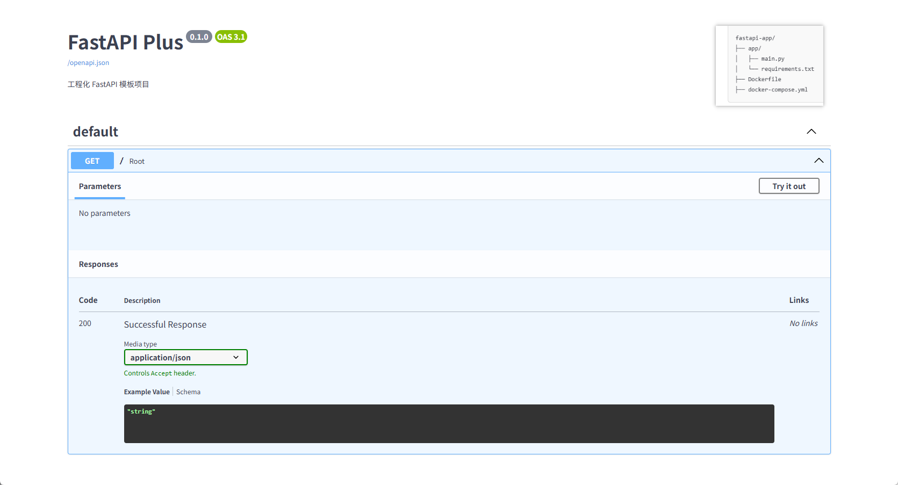

# Fastapi Plus

这是一个Python FastAPI项目工程库，包含DB、Redis、MongoDB、JSON等工具和基础服务类。

### 组件：

- FastAPI: https://fastapi.tiangolo.com/
- uvicorn: https://www.uvicorn.org/
- SQLAlchemy: https://www.sqlalchemy.org/
- PyMySQL: https://pymysql.readthedocs.io/
- REDIS: https://github.com/andymccurdy/redis-py

这段Markdown代码列出了几个常用的Python库和工具的链接，这些工具在Web开发、数据库操作和缓存管理等方面非常有用。下面是每个工具的简要介绍：

1. **FastAPI**:
    - 链接: [https://fastapi.tiangolo.com/](https://fastapi.tiangolo.com/)
    - 用途: FastAPI是一个现代、快速（高性能）的Web框架，用于构建APIs。它基于标准Python类型提示，使得代码更清晰、更易于维护。
    - 特点: 高性能、异步支持、自动生成文档、支持OAuth2等。
    - 注意事项: 需要Python 3.6及以上版本。

2. **uvicorn**:
    - 链接: [https://www.uvicorn.org/](https://www.uvicorn.org/)
    - 用途: Uvicorn是一个基于ASGI（Asynchronous Server Gateway Interface）的轻量级服务器，用于运行FastAPI等ASGI应用。
    - 特点: 高性能、异步支持、支持WebSocket、易于部署。
    - 注意事项: 需要Python 3.6及以上版本。

3. **SQLAlchemy**:
    - 链接: [https://www.sqlalchemy.org/](https://www.sqlalchemy.org/)
    - 用途: SQLAlchemy是一个强大的SQL工具包和ORM（对象关系映射）库，用于Python应用程序与数据库之间的交互。
    - 特点: 支持多种数据库、灵活的查询语言、强大的ORM功能。
    - 注意事项: 需要Python 3.6及以上版本。

4. **PyMySQL**:
    - 链接: [https://pymysql.readthedocs.io/](https://pymysql.readthedocs.io/)
    - 用途: PyMySQL是一个纯Python实现的MySQL客户端库，用于连接和操作MySQL数据库。
    - 特点: 纯Python实现、兼容MySQL客户端/服务器协议、支持连接池。
    - 注意事项: 需要Python 3.6及以上版本。

5. **REDIS**:
    - 链接: [https://github.com/andymccurdy/redis-py](https://github.com/andymccurdy/redis-py)
    - 用途: redis-py是一个Python客户端库，用于连接和操作Redis数据库。
    - 特点: 支持Redis的所有数据类型、支持发布/订阅、支持事务等。
    - 注意事项: 需要Python 3.6及以上版本。

这些工具和库通常一起使用，可以构建高效、可扩展的Web应用程序，同时提供强大的数据库和缓存支持。在使用这些工具时，需要注意它们的版本兼容性、性能优化和安全性配置。

